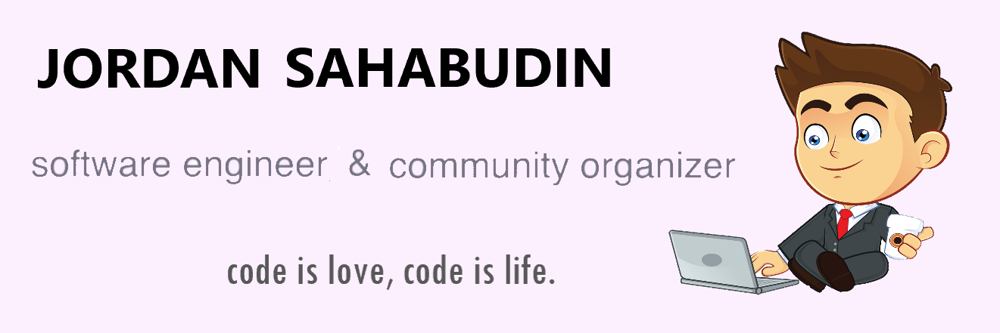

### Hi there, I'm Jordan.

## Full time student pursuing Software Engineering at Asia Pacific University.

- 🌱 I try my best to learn
- 👯 Teamwork makes the dreamwork
- 🥅 2021 Goals: Contribute more to Open Source projects
- 🏸 Fun fact: I love badminton

### Spotify Playing 🎧

### Connect with me:

[][linkedin]
[][instagram]

 

### Languages and Tools:

[][webdevplaylist]
[][webdevplaylist]
[][cssplaylist]
[][jsplaylist]
[][webdevplaylist]
[][webdevplaylist]
[][webdevplaylist]
[][webdevplaylist]
[][webdevplaylist]
[][webdevplaylist]
[][webdevplaylist]

 
 

### Status:

  

---

[instagram]: https://www.instagram.com/jordaaaannn_/
[linkedin]: https://www.linkedin.com/in/jordan-sahabudin-911830203/
[webdevplaylist]: https://www.youtube.com/playlist?list=PLkwxH9e_vrAJ0WbEsFA9W3I1W-g_BTsbt
[jsplaylist]: https://www.youtube.com/playlist?list=PLkwxH9e_vrALRJKu7wfXby3MKeflhTu6B
[cssplaylist]: https://www.youtube.com/playlist?list=PLkwxH9e_vrALSdvZuEh6gqQdmDoDIoqz4
[reactplaylist]: https://www.youtube.com/playlist?list=PLkwxH9e_vrAK4TdffpxKY3QGyHCpxFcQ0

